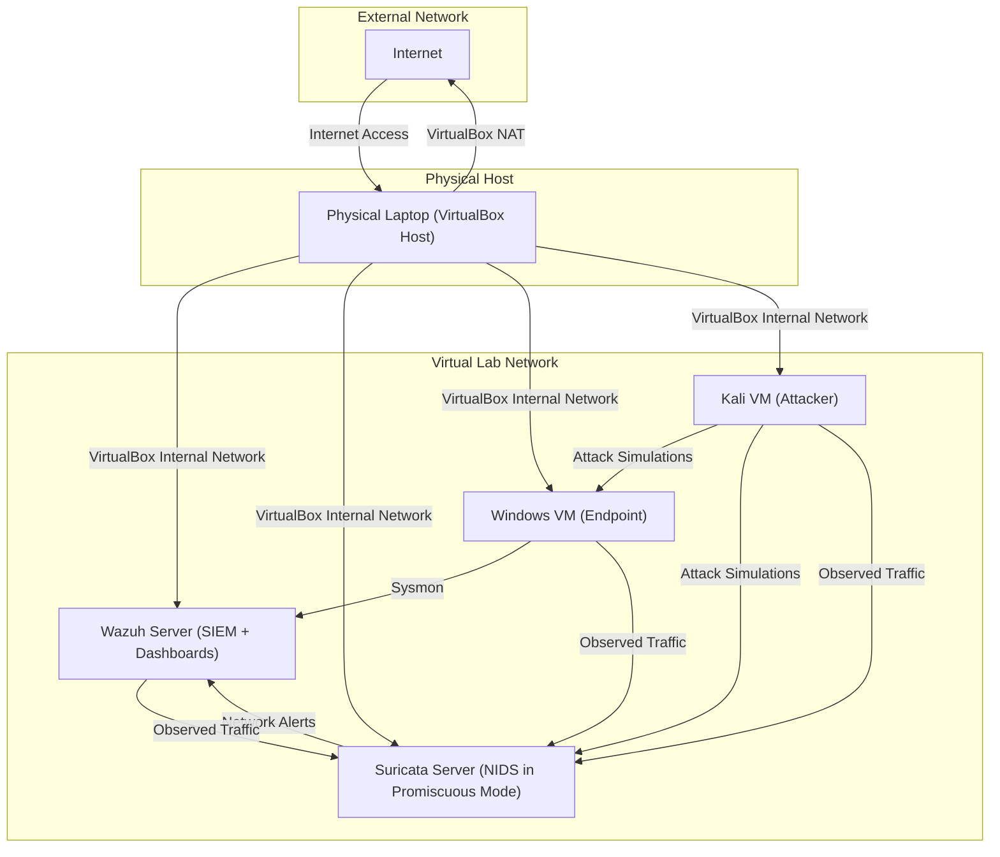

# Virtual Cybersecurity Lab

## Objective
This project aimed to establish a controlled environment for simulating, detecting, and analyzing cyber attacks using open source security tools. The primary focus was to create an integrated security monitoring system with Wazuh SIEM, Suricata IDS/IPS, and Sysmon endpoint monitoring to collect, correlate, and analyze security events. This hands-on environment was designed to provide practical experience in attack detection, threat hunting, and security operations.

### Skills Learned

* **SIEM Deployment & Management**: Deployed and configured Wazuh for centralized log collection, security event analysis, and real-time alerting.
* **Network Threat Detection**: Implemented and tuned Suricata in promiscuous mode with custom rules to detect network-based threats.
* **Endpoint Security Monitoring**: Configured Sysmon to collect detailed Windows telemetry including process creation, registry changes, and network connections.
* **Custom Detection Engineering**: Developed and tuned custom detection rules and signatures for both host-based and network-based threats.
* **Attack Simulation & Adversary Emulation**: Executed realistic attack scenarios using Kali Linux tools, manual exploitation, and MITRE ATT\&CK-aligned techniques.
* **Incident Correlation & Analysis**: Correlated multi-source telemetry (host and network) to identify complex attack patterns and lateral movement.
* **False Positive Reduction**: Tuned detection rules to reduce noise while maintaining detection effectiveness and rule accuracy.
* **MITRE ATT\&CK Mapping**: Mapped observed attack techniques to MITRE ATT\&CK framework for detection gap analysis and reporting.
* **Virtual Network Architecture**: Designed and configured virtual networks using VirtualBox NAT and internal networking for isolated lab environments.
* **Log Analysis & Alert Triage**: Interpreted and analyzed security logs, prioritized alerts, and refined detection strategies based on observed activity.

---

## Lab Components

| Component         | Purpose                                      |
| ------------------ | -------------------------------------------- |
| **Wazuh Server**   | Security Information and Event Management (SIEM), log analysis, dashboards |
| **Wazuh Agent**     | Collect and process security-related data and trasmit it to the Wazuh server |
| **Suricata Server**| Network Intrusion Detection System (NIDS) monitoring network traffic |
| **Windows 10 VM**  | Endpoint for attack simulation and telemetry generation |
| **Kali Linux VM**  | Attack simulation platform |
| **VirtualBox**     | Virtualization platform managing the entire lab |
| **Sysmon**         | Windows endpoint telemetry (process, registry, network logs) |
| **MITRE ATT&CK**   | Adversary tactics and techniques mapping |

---

## Network Architecture

---

## Attack Simulations

The following attacks were simulated in the lab to generate telemetry and test detections:

* Network scanning (Nmap)
* Brute force login attempts
* PowerShell exploitation
* Lateral movement simulations
* Credential dumping (mimikatz, hashdump)
* Command & Control emulation
* Malware execution simulations
* MITRE ATT\&CK-based Atomic Red Team test cases

---

##  Detection Strategy

* Host-based detections collected by Sysmon forwarded to Wazuh.
* Network-based detections collected by Suricata running in promiscuous mode.
* Custom Suricata rules modified to detect scanning, exploits, and command & control activity.
* Wazuh rules tuned to correlate multiple event types for higher-fidelity alerts.
* Detections mapped to MITRE ATT\&CK framework for better coverage visibility.

---

## Sample Screenshots

* **Suricata Alert Logs**: Custom rules detecting simulated attack traffic.

* **MITRE ATT\&CK Coverage Map**: Highlighted techniques detected during simulations.

* **Wazuh Dashboard**: Showing real-time alerts and event correlation.

---

## Next Steps & Future Improvements

* Add honeypots for deception and additional telemetry.
* Deploy a virtual firewall for perimeter simulation.
* Implement a SOAR response workflows.
* Expand attack coverage with MITRE Caldera or full Atomic Red Team coverage.
* Include an Active Directory server
* Include a Mail Server
